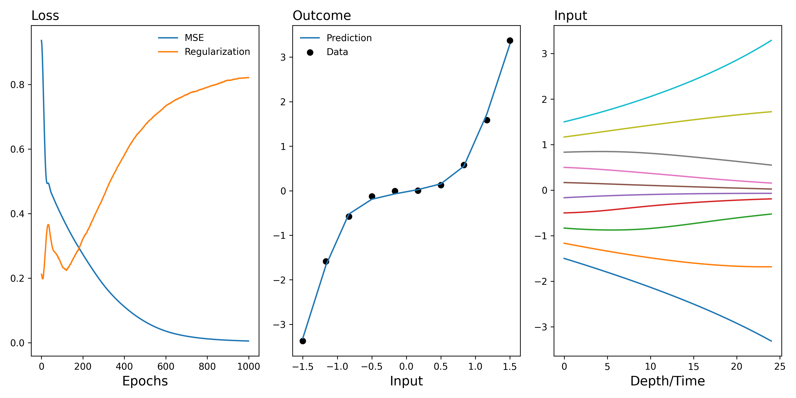

!!! tldr "Overview"

    The previous section highlighted how bi-level gradient descent is a potentially an attactive approach when estimating nonparametrics estimands with clustered data. It may not be immediatley clear, though, why this "gradient based" partialled out approach is also well suited when were intersted in estimating a parametric estimand. 

<figure markdown>
{ width="500" }
{ width="500" }
<figcaption>Normalized Sampling Distribution</figcaption>
</figure>  

??? tip "Abstract Algebra"

    - Sets
    - Group (functions defined on this set)

    What structure on $\mathbb{R}^n$ should we preserve? 

    $$\begin{align*} g : {\text{bijections}} \to \mathbb{R^n} \to \mathbb{R^n} \end{align*}  \equiv \text{Sym}(\mathbb{R}^n)$$

We don't assume cross-sectional selection on observables:

$$ Y_i(d, 1) \perp D_i | X_i  \quad \forall d $$

We assume de-panelled selection[^1] on observables:

$$Y_i(d,1) - Y_i(0, 0) \perp D_i \big | X_i \quad \forall d $$

This assumption provides justification for interpreting $\beta_1$ as the causal effect:

$$\begin{align*} Y_{1,i} - Y_{0,i} &= \beta_0 + \beta_1 D_i +  \varepsilon _i  \\  
Y_{1,i}  &= \beta_0 + \beta_1 D_i + Y_{0,i} +  \varepsilon _i \end{align*} $$

<!-- ??? Warning inline end "Double Machine Learning Example"

    <figure markdown>
    { width="500" }
    <figcaption>Normalized Sampling Distribution</figcaption>
    </figure> -->
In practice, we don't usually condition on $X_i$ (which means there's no reason to correct for $\mathbb{P}(D|X)$, and this is very attractive because we know that the partially linear model fails to correct for this! --> See [Double Machine Learning Example](./examples.md))
and we allow 

$$Y_{0, i} \approx f(X_i, D_i) $$

But in some sense, this kinda feels like cheating because it suggests that de-panelled selection on observables is easier to work with than cross-sectional selection on observables. 

[^1]: Repeated cross-section