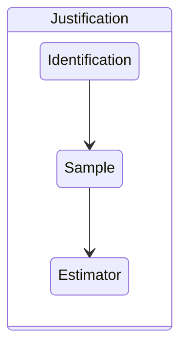

### **Perspective**

#### **Maybe?!**
Applied econometrics is all about interpretation. Specifically, it's about interpreting the result of a statistical procedure in a given context. 

The sobering reality of applied causal inference is that you often find yourself betting on something you don't believe is true, don't care about, or some combination of the two. No approach to causal inference can avoid this reality.

Taken together, the joke here is that applied econometrics is "easy" or at least requires little effort because this interpretation is always some flavor of "maybe". 

#### **Identification**

In observational studies, you are amost never identified underreasonable assumptions. 

### **Principles**
!!! cite "The Bitter Lesson" 

    The lasting impression from Rich Sutton's [The Bitter Lesson](http://www.incompleteideas.net/IncIdeas/BitterLesson.html) is that one should step in the direction of greater compute. That is, one should work on methods that scale with greater computation.

    

!!! cite "Category Theory for Programmers" 

    Ideas should be explained at the level of detail so as to enable composition
   
