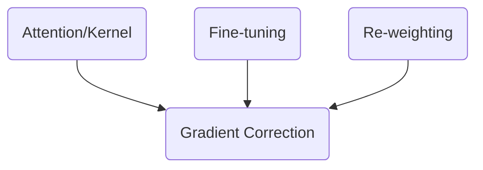

 

??? cite "Motivating Quotes" 

    ### **Direction of Great Compute**
    - The lasting impression from Rich Sutton's [The Bitter Lesson](http://www.incompleteideas.net/IncIdeas/BitterLesson.html) is that one should step in the direction of greater compute. That is, one should work on methods that scale with greater computation.

    ### **Composition**
    - The central takeway from [Category Theory for Programmers](https://bartoszmilewski.com/2014/11/04/category-the-essence-of-composition/) is that *Ideas should be explained at the level of detail so as to enable composition*  

<iframe src="https://slides.com/pharringtonp19/minimal/embed?token=FxFf2FUF" width="576" height="420" title="Minimal" scrolling="no" frameborder="0" webkitallowfullscreen mozallowfullscreen allowfullscreen></iframe>
 
### **Introduction**

- Following the approach advocated in [Mostly Harmless Econometrics](https://www.mostlyharmlesseconometrics.com/), we view causal inference techniques as methods that aim to correct for the fact that the data is not generated from a randomized experiment.[^1] 

- In this project, we specifically consider problems that can be thought of as "sampling" problems. That is, contexts where you have clusters of observations or where the proposenity-score is non-uniform. 

- In this setting, the problem of correcting for the non-RCT natue of one's data becomes the challenge of implementing a "local" correction in a statistically and computationally reasonable way.

 
### **Related Literature**
- "The main result is going to be a methodology based on double robust estimation that can as inputs generic, black-box type machine learning estimates, and as outputs give you confidence intervals \dots and all the guarantees that you would like" --[ref](https://youtu.be/ZA8iOjUR8aY?list=PLxq_lXOUlvQAoWZEqhRqHNezS30lI49G-&t=224)

### **Approach**

- We consider the following three sampling correction approaches:

 Method | Challenge |
| --- | --- |
| Kernel Adjustments | Expensive $O(n^2)$ |
| Re-weighting | Generative Modeling | 
| Finetuning | Right Space | 

- All of which can be understood as a gradient correction[^2]

- As is the case with applied causal inference we don't select the best option so much as wel choose the "least" bad option![^3]

### **Preview of Cherry-Picked Results**

 
 
 

 

[^1]: We define our problem via a probability space with a probability measure that "corresponds" a randomized control trial.
    
    $$\big(\Omega, \mathcal{F}, \mathbb{P}_{\text{randomized}} \big)$$
    
    Given this probability space, we can define the parameter of interest as some function of the probability measure. 

    $$\theta_0 = f(\mathbb{P}_{\text{randomized}} ) $$

    The non-randomized aspect of the data is then captured via some transformation $T$, such that 

    $$\mathbb{P}_{\text{observed}} = T(\mathbb{P}_{\text{randomized}} )$$

[^2]: At a high level, a challenge in applied econometrics is to develop/propose/motivate methods that can make use of the ongoing work in deep learning. We remain model agonstic in the sense that our methods focus on gradient corrections (i.e. within training corrections) which is different from the post-training corrections as proposed in alternative methods like [Double Machine Learning](https://academic.oup.com/ectj/article/21/1/C1/5056401)
 
 [^3]: Applied econometrics is all about interpretation. Specifically, it's about interpreting the result of a statistical procedure in a given context. The sobering reality of applied causal inference is that you often find yourself betting on something you don't believe is true, don't care about, or some combination of the two. No approach to causal inference can avoid this reality. Taken together, the joke here is that applied econometrics is "easy" or at least requires little effort because this interpretation is always some flavor of "maybe". 